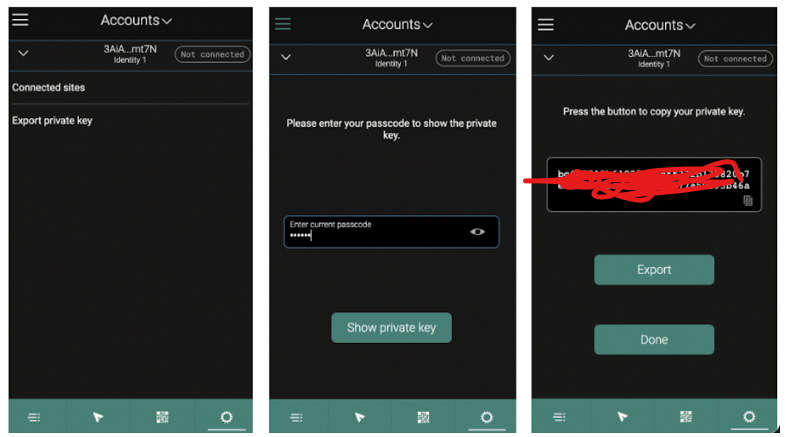
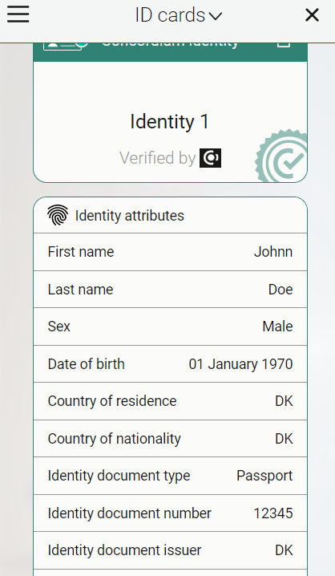
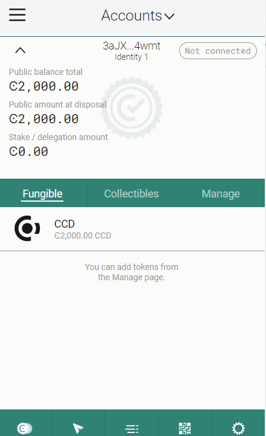
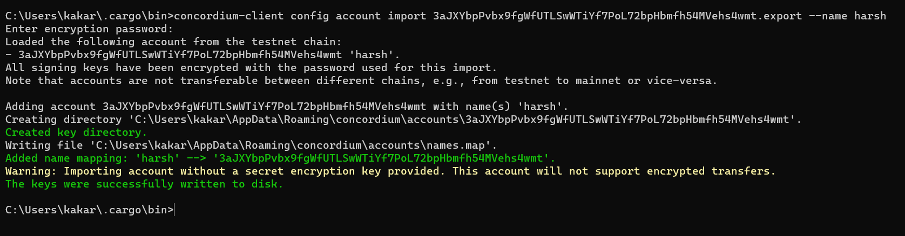

## Gitcoin
## Concordium Hackathon - The Future of Identity
### Note : This did this task on windows:-

#### This documetation is by the team :
https://docs.google.com/document/d/1MNcJaZrvBgoBZExs8x0dmwBY0SUDXRNgOzfTwIYVHHg/edit 

To install Rust, download and run rustup‑init.exe on https://rustup.rs/

Run: "rustup target add wasm32-unknown-unknown" after 

Rust Installation

To install cargo-concordium, download https://developer.concordium.software/en/mainnet/net/installation/downloads-testnet.html#cargo-concordium-testnet copy and paste .exe %HOMEPATH%.cargo\bin, change the name to "cargo-concordium.exe"

Download and Install Concordium Client: https://developer.concordium.software/en/mainnet/net/installation/downloads-testnet.html#concordium-node-and-client-download-testnet

Download the extension wallet here:
https://chrome.google.com/webstore/detail/concordium-wallet/mnnkpffndmickbiakofclnpoiajlegmg/related

When you have created your account and claimed your CCD, you will need to export the keys from your wallet. Save the file on your local machine in the same folder as the rest of the repository. It will have a name like this  <YOUR PUBLIC ADDRESS>.export. You can open it with a text editor and see your signKey and verifyKey in there. 

Create Identity

Get faucet tokens 

Import the keys

## MY details:

- My legacy mainnet concordium wallet address : '3H9sJKQsDrwopkE7SFjKi69dkAh3thSsZu1Jtk4LQqQK7V2Weo';
- My testnet concordium wallet address : '3aJXYbpPvbx9fgWfUTLSwWTiYf7PoL72bpHbmfh54MVehs4wmt';
- My email :"harshmittal1750@gmail.com";
- My gitcoin id : https://gitcoin.co/harshmittal1750